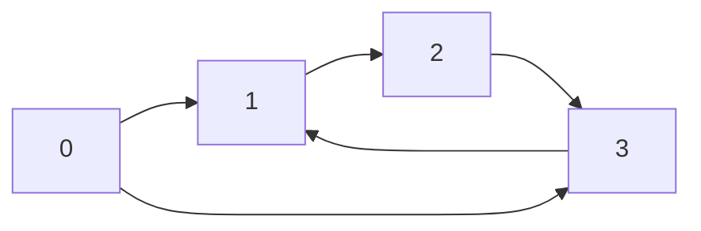

# Cluster

Cluster is a crate that define the Cluster and Node traits.
The trait cluster is a Trait to represent Graph data structure.

## Implementing Cluster.

To implement Cluster for the structure of you choice, you must before implement a structure that implement to Trait Node.

### Functions to implement :

---

#### get

Get a node from the graph.

**Parameter**

- key - the index of the node in the Graph. 

**Returns**

An option containing an immutable reference to the Node if present in the Graph, returns None otherwise.

```rust
fn get(&self, key: &K) -> Option<&N>;
```

---

#### get_mut

Get a node from the graph.

**Parameter**

- key - the index of the node in the Graph.

**Returns**

An option containing a mutable reference to the Node if present in the Graph, returns None otherwise.

```rust
fn get_mut(&mut self, key: &K) -> Option<&mut N>;
```

---

#### new_key

Generate a key that is not already used in the graph and returns it.

**Return**

The key newly generated

```rust
fn new_key(&self) -> K;
```

#### contains_key

Check if the Cluster contains a node at a given key.

**Parameter**

- key - The key on we want to check the Cluster contains it or no.

```rust
fn contains_key(&self, key: &K) -> bool;
```

---

#### add

Add a node in the Cluster.

**Return**

The index at which the node has been stored in the graph.

```rust
fn add(&mut self, node: N) -> K;
```

---

#### remove

Removes the designated Node from the graph.

**Parameter**

- key - The key of the Node to remove.

```rust
fn remove(&mut self, key: K) -> Result<()>;
```

---


## Implementing Node.

### Functions to implement :

**adj**

Get the adjacency of the current Node.

**Return**

A immutable reference to the adjacency list of the current Node.

```rust
fn adj(&self) -> &Vec<K>;
```

---

**adj_mut**

Get the adjacency of the current Node.

**Return**

A immutable reference to the adjacency list of the current Node.

```rust
fn adj_mut(&mut self) -> &mut Vec<K>;
```

---

## Help

## Reminder



> For this Cluster (graph), the adjacency list of the node 0 would be [1, 3];
